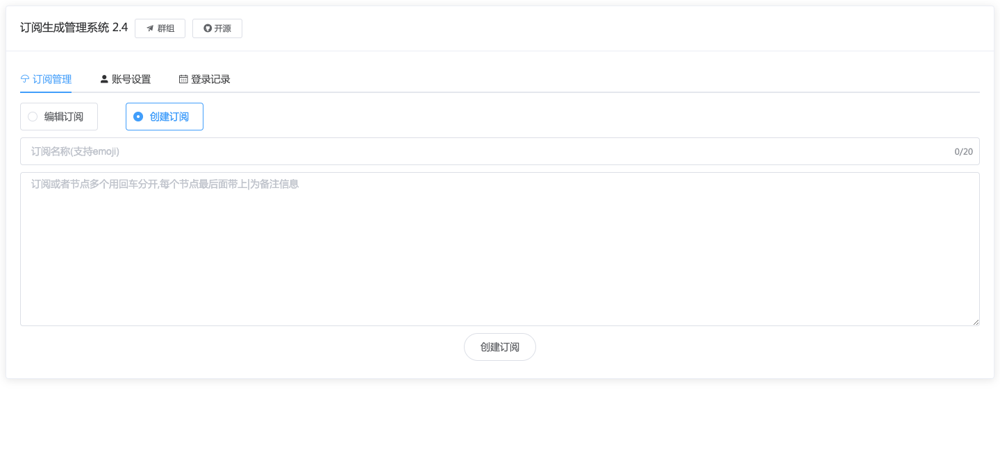
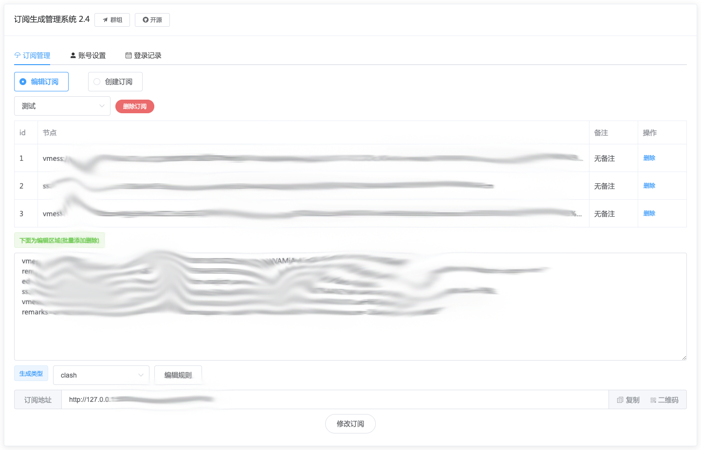

# sublink for python3
[![电报群组][telegram-image]][tg-url]
![python][python-image]
![vue2][vue-image]
[![作者][author-image]][author-url]

[telegram-image]:https://img.shields.io/badge/%E7%94%B5%E6%8A%A5%E7%BE%A4%E7%BB%84-TG-red?label=%E7%94%B5%E6%8A%A5%E7%BE%A4%E7%BB%84
[tg-url]:https://t.me/+u6gLWF0yP5NiZWQ1
[python-image]:https://img.shields.io/badge/python3.8.2-blue
[vue-image]:https://img.shields.io/badge/vue2-rand
[author-image]:https://img.shields.io/badge/%E4%BD%9C%E8%80%85-TG-8A2BE2
[author-url]:https://t.me/toutie_1

<p align="center">
   
   
</p>

# 更新说明：
新增节点国旗自动插入

支持填写订阅节点让其动态解析而不是直接解析出节点

新增订阅解析器

# 功能说明：

节点转换成订阅，并且能够一直存储

方便多订阅管理，个人搭建使用

解决安全问题预防被偷节点,集成前后端

目前支持v2ray|clash|surge

v2ray格式通用的软件已测有下:v2rayn 小火箭等，还有一些没用过不知名

默认账户密码都是admin，请记得修改否则容易泄漏

# 安装说明：

## 拉取或者更新docker镜像

如果你有旧版本拉取前可以先停止和删除容器再删除镜像

docker rm -f sublink

docker images

docker rmi 这里填写IMAGEID

然后拉取镜像输入，默认拉取就是最新版本

## 启动docker

进入到你的目录比如你可以创建一个sublink目录然后输入

```
docker run --name sublink -p 8000:5000 \
-v $PWD/db:/app/app/db \
-e PORT=5000 \
-d jaaksi/sublink
```

如果要自定义端口 -p 5000:5000左边的5000改成自定义右边为固定如:8000:5000

那么ip加8000端口即可访问

# 假如你忘记了账号或者密码

初始化为admin，确保你的容器在运行的时候终端执行以下命令：

    docker exec -it sublink bash -c "python init_user_pw.py; exit"

USDT打赏：


## Stargazers over time
[](https://starchart.cc/jaaksii/sublink)
